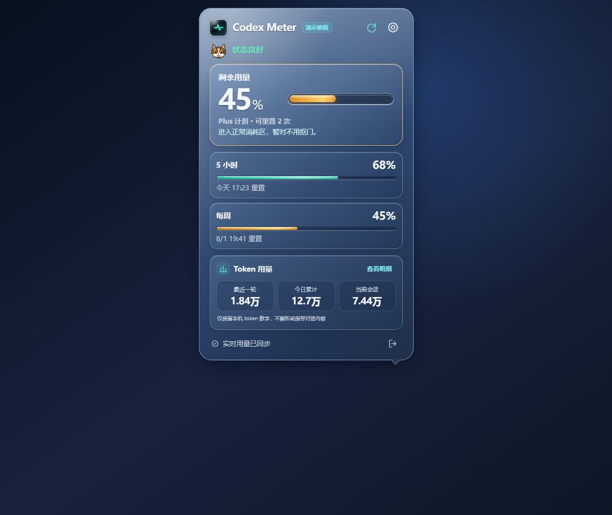

# Codex Meter

## Passport 聊天副屏

Meter 内置 Bridge，通过配对认证的 TLS 局域网连接将 Codex 状态、额度和最近消息发送到 FoloToy AI Passport。需要电脑安装 Node 22 或更新版本，并登录 Codex。设置中选择“绑定设备”，手机进入 Passport 配网页面填写 Wi-Fi 和 Meter 的四位绑定码，设备验证后确认保存；随后开启 Passport 连接。退出 Meter 会停止 Bridge。

设备按 OK 打开四条一页的聊天列表，UP/DOWN 选择及翻页，OK 切换目标，长按 OK 600 毫秒返回。目标保存在私有 `selected-chat.json`，独立于电脑当前打开的聊天；未加载的目标可能需要先在 Codex 打开。待审批或提问期间不能切换。

匹配固件显示右侧紫色用户气泡、左侧薄荷色助手气泡，无角色标题，短消息按内容收窄。长消息按完整字符拆成连续气泡，每块最多 450 个 UTF-8 字节，不再截掉后续正文。每页两块，最新页显示末尾两块；顶部再按 UP 加载更早部分，底部再按 DOWN 返回较新部分，回第一页恢复实时消息。底部页码显示 `...` 时正在加载，`!` 时失败，可重试。不显示工具、推理、图片或 Markdown 排版。顶部状态栏显示五小时、每周剩余额度和电池。图标使用原创 7×7 像素点阵。

首次历史请求冻结只读消息快照，后续 revision 翻页不被新消息挤动；历史阅读不受实时正文覆盖。设备仅保留当前两条，电脑最多缓存 200002 条过滤截断后的正文，不写入选择文件。切换聊天或设备断线使快照失效，重连恢复实时页。

实时 IPC 缺少历史时，Bridge 通过独立只读 `thread/read` 补读；设备在线且缺少实时正文时，每十秒最多一次，不启动或恢复对话。接口在电脑读取历史后提取两条消息，因此读取成本随历史增长。过期读取结果丢弃，失败保留已有正文。同聊天刷新保持滚动，切换聊天回到开头。

如果能切换但没有正文，请同时更新固件与 Meter，退出并重新运行 Meter，检查连接开关、Codex 登录和目标聊天是否已加载。仅替换磁盘资源不会更新已有 Bridge 进程。兼容固件升级保留设备 NVS 与配对；电脑地址或证书变化时重新绑定。

开发构建：`npm run tauri -- build --debug --bundles app`，入口自动准备锁定的 Bridge 依赖与资源索引。不要提交运行凭据、私钥、设备日志或构建产物。详细绑定与实现说明见 [Passport Bridge](docs/passport-bridge.md)。当前屏幕、实体按键、断网恢复和长期运行仍需设备验收。

Codex Meter 是一款面向 Windows 系统托盘和 macOS 菜单栏的轻量 Codex 用量查看工具。

它通过本机官方 `codex app-server` 读取当前 ChatGPT 账户的用量窗口，并使用平台适配的玻璃小猫状态图标与轻薄玻璃气泡面板展示剩余额度、重置时间和套餐类型。

## 当前状态

| 平台 | 状态 | 产物 |
| --- | --- | --- |
| Windows 10/11 | 已完成首个可验证版本 | `codex-meter.exe` |
| macOS | 由 GitHub Actions 构建，等待真机验收 | `.app` / `.dmg`（ad-hoc 签名） |

Windows 版本已验证生产构建、单实例、右键菜单、深色模式、窄尺寸布局和基础交互。macOS 仍需在真实 Mac 上验证菜单栏定位、Retina 缩放、Vibrancy 效果和应用签名。

## macOS 界面预览



> 使用项目内置演示数据生成，用于展示菜单栏面板界面；macOS 实机效果仍以真机验收为准。

## 主要功能

- 显示 Codex 5 小时和每周用量窗口。
- Windows 托盘只显示方形玻璃小猫，通过表情和耳朵姿态表达用量状态。
- macOS 菜单栏将玻璃小猫与进度条左右排列，同时表达状态和剩余额度。
- 小猫采用深蓝玻璃本体、霓虹状态轮廓、高光大眼和极简嘴型。
- 自动选择剩余比例更低的窗口作为托盘主状态。
- 展示本地时区下的额度重置时间。
- 接口支持时展示账户当前可用的额度重置次数。
- 根据剩余用量显示不同的轻松提示文案。
- 自动识别 Plus、Pro、Team、Business 等套餐名称。
- 每分钟自动刷新，也可手动立即刷新。
- 可在设置中开启“随系统登录启动”，默认关闭。
- 刷新失败时保留最后一次成功结果并标记为旧数据。
- 5 分钟内的短暂失败显示“正在重连”，超过 5 分钟才进入数据过期状态。
- 跟随系统浅色/深色模式。
- 支持上下左右任务栏、DPI 缩放和工作区边界限制。
- 点击窗口外部或按 `Esc` 自动收起面板。
- 单实例运行，重复启动只会唤起已有程序。

## 界面设计

- 轻薄玻璃质感：半透明背景、细边框、高光和柔和阴影。
- 气泡箭头自动指向托盘图标。
- 无标题栏、无任务栏窗口按钮、无浏览器右键开发菜单。
- 设置、加载、无数据、过期和错误状态均有明确反馈。

## 数据来源与准确性

Codex Meter 使用本机 Codex CLI 提供的 `codex app-server` JSON-RPC 接口：

```text
initialize
  → initialized
  → account/read
  → account/rateLimits/read
```

用量口径：

- 后端返回 `usedPercent`，界面展示 `remainingPercent = 100 - usedPercent`。
- 根据 `windowDurationMins` 识别 5 小时和每周窗口，不依赖返回数组顺序。
- 套餐类型优先采用实时 rate limits 响应，避免显示过期账户信息。
- `resetsAt` 按 Unix 秒解析，并使用系统时区显示。
- Token 摘要来自本机 Codex 会话文件中的独立 `token_count` 事件，通过累计值差分计算最近一轮、今日累计和当前会话。

## 隐私与安全边界

- 不读取或复制 `~/.codex/auth.json`。
- 用量统计读取 `~/.codex/sessions` 和 `~/.codex/archived_sessions` 时只解析相关事件的类型、时间戳和 token 数字，不解析或保存提示词、回复与代码内容。启用 Passport 聊天副屏后，Bridge 会读取所选聊天的正文并发送到已配对设备；选择文件仅保存 ID 与标题，不保存消息正文。
- 不保存 OpenAI access token、refresh token 或浏览器 Cookie。
- 不直接调用未公开的 `chatgpt.com/backend-api/wham/usage`。
- 登录和令牌刷新完全交给用户已安装的 Codex CLI/App Server。
- 不上传用量记录，缓存仅保存在本机。

## 运行要求

- 已有可用的 Codex 登录：macOS 可使用新版 ChatGPT/Codex 桌面程序内置版本；其他情况需让终端可以正常运行 `codex --version`。
- macOS 会自动识别 `/Applications/ChatGPT.app`、旧版 `/Applications/Codex.app` 及用户应用目录中的内置 Codex，无需额外配置。
- Windows 需要 WebView2；Windows 10/11 通常已预装。

如果 Codex CLI 不在系统路径中，可以通过环境变量指定：

```powershell
$env:CODEX_METER_CODEX_PATH = "C:\path\to\codex.exe"
```

## 本地开发

需要 Node.js 20+、Rust stable 和对应平台的桌面构建工具。

Windows 需要 Visual Studio C++ Build Tools，macOS 需要 Xcode Command Line Tools。

```text
npm install
npm run tauri:dev
```

仅预览前端界面：

```text
npm run dev
```

浏览器预览使用明确标记的演示数据，不会连接真实 Codex 账户。

## 构建

Windows：

```text
npm run tauri -- build
```

macOS 必须在 Mac 上构建：

```text
npm ci
npm run tauri -- build --bundles app,dmg
```

测试版使用 ad-hoc 签名，避免 Apple Silicon 将下载包直接判定为损坏；首次打开仍可能需要在“隐私与安全性”中允许。用于公开分发时，仍建议配置 Apple Developer 证书、公证和 Stapling。

## GitHub Actions 自动打包

仓库中的 `构建 Windows 和 macOS 安装包` 工作流会在推送到 `main` 分支或手动触发时构建：

- Windows x64：便携版 `.exe` 和 NSIS 安装包。
- macOS Apple Silicon：未签名 `.app` 和 `.dmg`。
- macOS Intel：未签名 `.app` 和 `.dmg`。

构建完成后，可在 GitHub 仓库的 **Actions → 对应运行记录 → Artifacts** 下载，产物保留 14 天。

## Code signing policy

本项目计划通过 SignPath Foundation 为开源版本提供免费代码签名。签名流程、团队职责和隐私声明见 [CODE_SIGNING_POLICY.md](CODE_SIGNING_POLICY.md)。

## 开源许可证

本项目采用 [MIT License](LICENSE)。

## 验证命令

```text
npm run typecheck
npm run build
cargo fmt --manifest-path src-tauri/Cargo.toml --check
cargo test --manifest-path src-tauri/Cargo.toml
cargo check --manifest-path src-tauri/Cargo.toml
```

## 技术栈

- Tauri 2
- Rust
- TypeScript
- Vite
- 原生 HTML/CSS，无 React 和额外 UI 框架

后台由 Rust 负责 Codex App Server 通信、托盘状态和窗口定位；WebView 只负责轻量界面渲染。

## 已知限制

- macOS 尚未真机打包和视觉验收。
- Windows 原生 Acrylic 在部分 WebView2 环境可能导致灰屏，目前默认使用稳定的 CSS 轻玻璃方案。
- Windows 安装包仍需完成签名和更多 DPI、多显示器测试。
- macOS App Store 版本需要重新评估私有透明窗口 API。

## 项目结构

```text
src/                 前端界面与样式
src-tauri/src/       Rust 后端、托盘和窗口逻辑
src-tauri/icons/     Windows/macOS 应用图标
src-tauri/tauri.conf.json
```

## 实验性 Passport 语音转写

Bridge 已接入录音会话、PCM 传输、FunASR offline 适配、全文分页预览和确认提交。首次使用需要在私有 Bridge 环境配置中设置 `PASSPORT_ASR_URL`；可选 `PASSPORT_ASR_TOKEN` 仅适用于支持认证的网关。原生 FunASR 不验证该认证头，不能作为长期暴露的服务。

Passport 阅读正文时长按 OK 600 毫秒进入语音页，OK 开始／停止录音，预览后再次按 OK 确认。录音最长30秒，切换聊天、审批、配对或断线会取消；结果不确定时禁止自动重试。真实设备录音、NAS性能与 Desktop 提交仍待验收，当前不是已验收发布版本。
