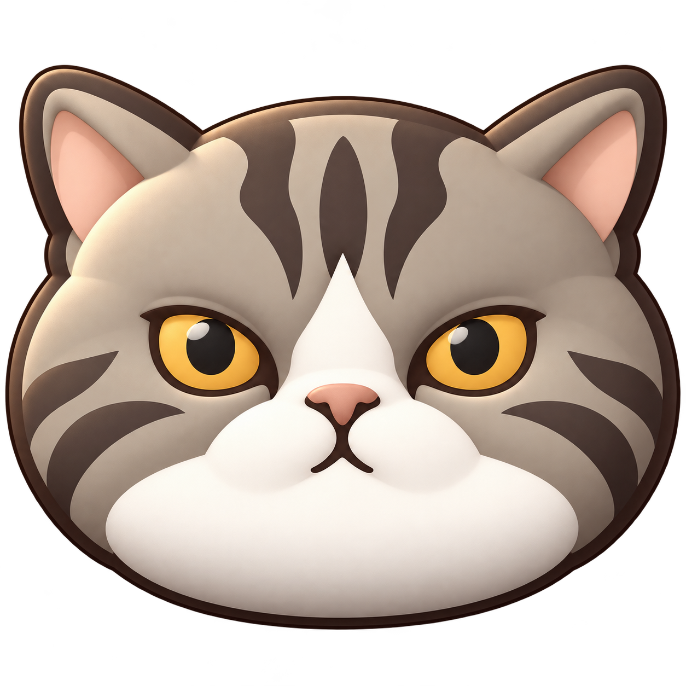
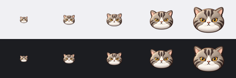

# Codex Meter 设计与资产库

本目录保存经过确认的设计方向和可复用素材。当前资产用于下一版设计，尚未接入应用或替换现有运行时图标。

## 猫图标 v1 · 已确认

以用户提供的真实猫照片为唯一形象基准，先绘制简化头像，再转为 3 渲 2 风格。用户已确认此版本，后续头像、托盘与任务栏图标应沿用同一只猫。

### 稳定的形象特征

- 宽圆脸、短鼻、小三角耳与略严肃的温和神态。
- 灰棕虎斑、额头三条深色纹、两侧脸颊纹。
- 金色眼睛、深色瞳孔、低饱和粉色鼻子。
- 连续的白色鼻梁、口鼻区和下巴。
- 平滑体积、柔和光影和克制高光；避免写实毛发、细碎纹理和额外装饰。

### 素材索引

| 文件 | 用途 |
| --- | --- |
| [cat-taskbar-3d.png](assets/cat/v1/cat-taskbar-3d.png) | 1254 × 1254 透明 PNG 母版；状态区头像及后续导出来源 |
| [cat-taskbar.ico](assets/cat/v1/cat-taskbar.ico) | Windows 图标，包含 16、24、32、48、64、128、256px |
| `cat-taskbar-{size}.png` | 上述七种尺寸的独立透明 PNG |
| [cat-taskbar-size-preview.png](assets/cat/v1/cat-taskbar-size-preview.png) | 浅色、深色背景预览；从左到右为 16、24、32、48、64px |

优先保障任务栏的小尺寸辨识度。32–48px 五官较清晰，16px 主要依靠轮廓与配色。接入时按系统实际像素尺寸选用素材，保留透明背景和宽高比，不重复压缩或拉伸。

已检查浅色与深色背景的小尺寸预览、PNG 尺寸与透明背景，以及 Windows ICO 可读取性。实际托盘、任务栏、系统缩放与 macOS 菜单栏仍需在接入后验证；当前彩色素材不等同于 macOS 单色 template 图标。

## 后续界面方向

外层参考 Vision Pro 的通透感：轻薄玻璃、柔和边缘与层次。内层参考 Linear 的克制感：清晰的信息层级、紧凑布局与安静的控件。猫图标保持自然灰棕色与白色口鼻区，不将本体改为透明玻璃材质。

## 生成与版本规则

使用内置 imagegen 生成。最终提示规范：保留已绘制猫的脸型、五官、配色与虎斑结构；仅增加脸颊、口鼻和耳部体积，采用平滑哑光表面、受控明暗与左上柔光；优先适配 24/32/48px；透明背景，无细毛、胡须、文字、底板和外部投影。

真实猫照片不随本次提交发布。后续修订保留 v1，在新版本目录内保存，避免覆盖已确认素材。
